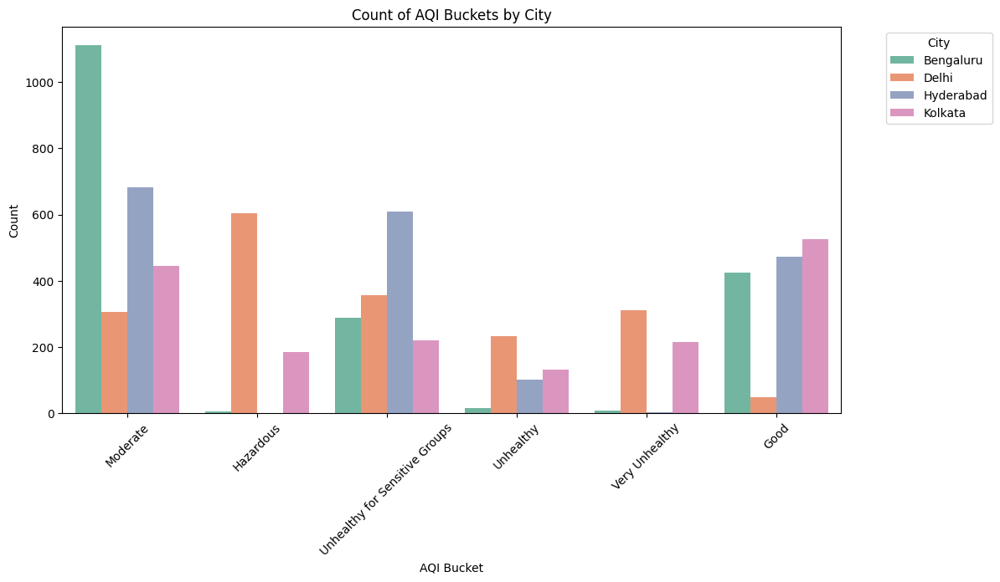
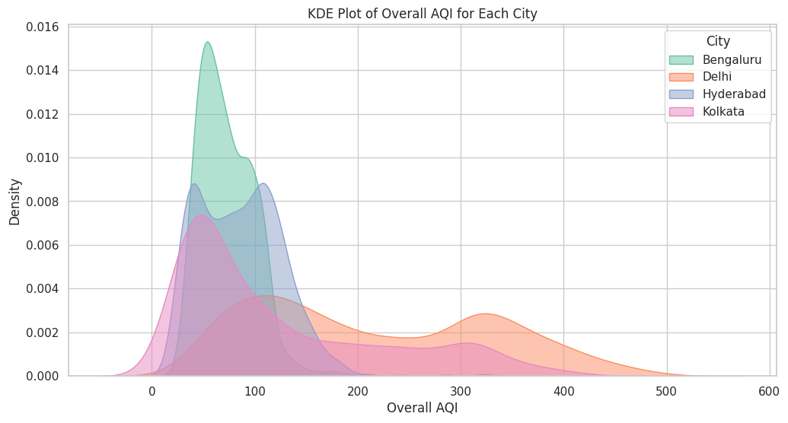
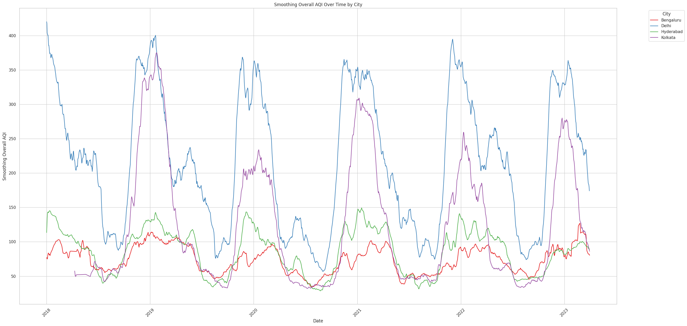
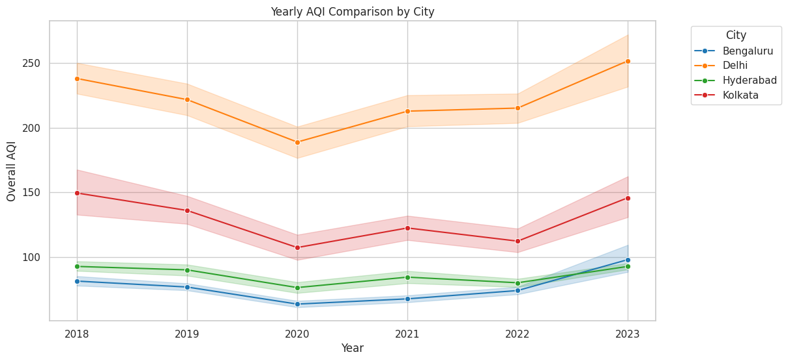
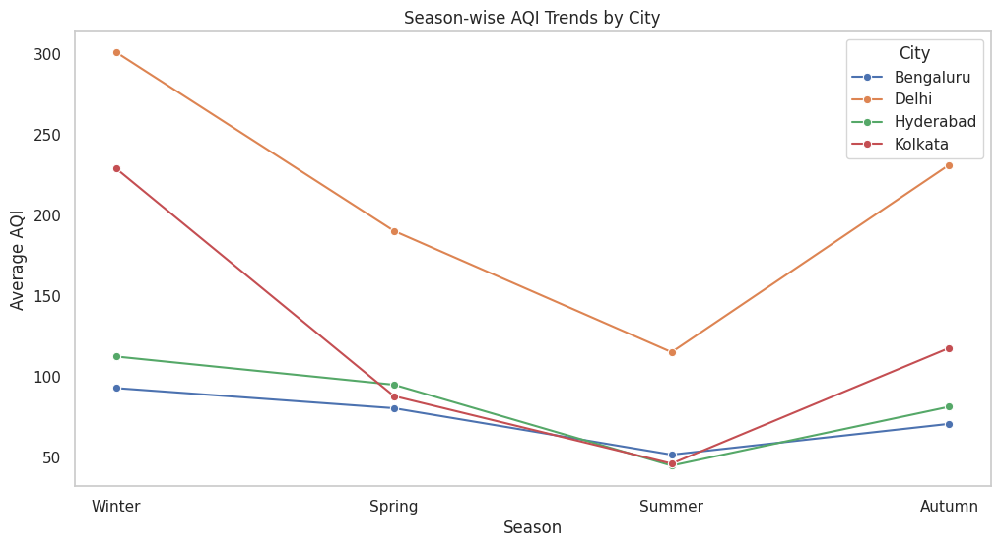
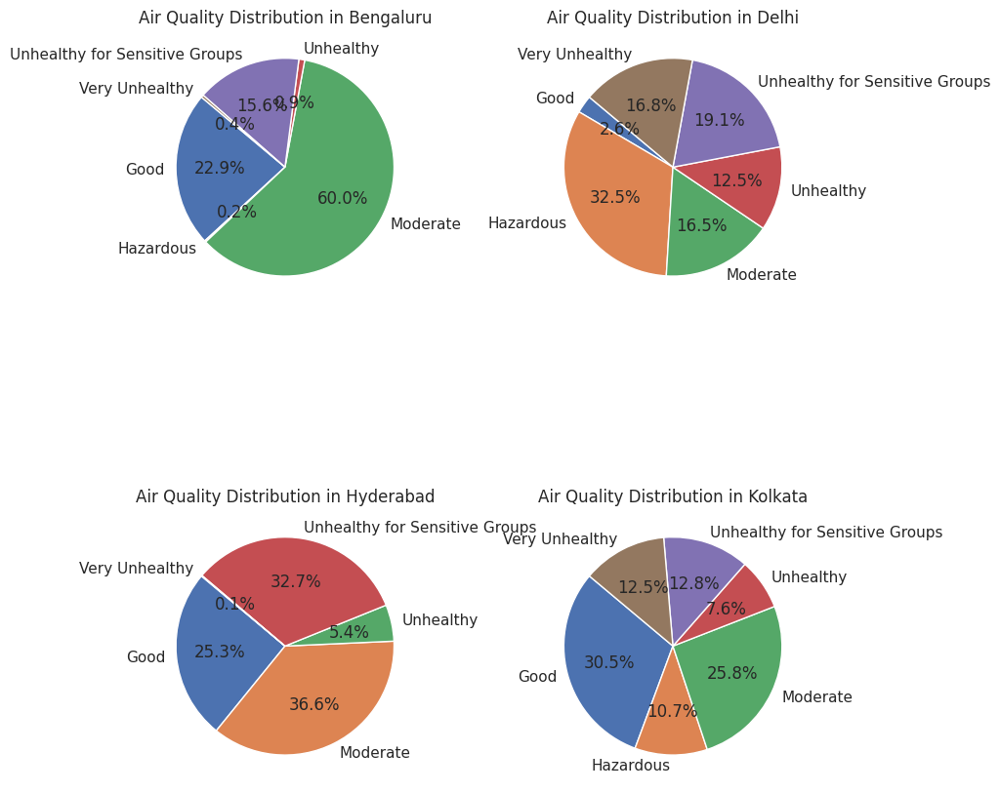
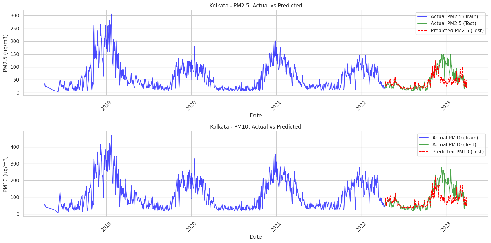
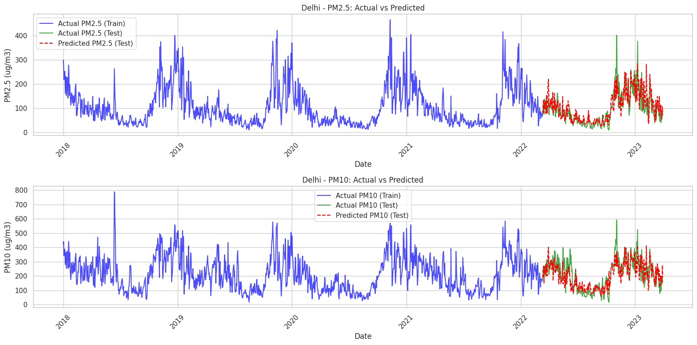

# AirSage Smart AQI Analytics

## Overview  
**AirSage Smart AQI Analytics** is a data-driven project focused on analyzing air quality trends in major Indian cities. This project extracts, processes, and visualizes AQI (Air Quality Index) data, applying **machine learning** techniques to predict pollution levels.

## Features  
- **Data Collection:** Retrieves AQI data from Kaggle datasets.  
- **Data Preprocessing:** Cleans and transforms time-series pollution data.  
- **Exploratory Data Analysis (EDA):** Generates meaningful visualizations.  
- **Machine Learning Predictions:** Uses Random Forest and KNN models.  
- **Performance Evaluation:** Measures model accuracy using MSE and R² scores.  
  
## Visualizations

### 1. AQI Count by City
  
A bar chart showing the count of AQI (Air Quality Index) buckets by city, including Bengaluru, Delhi, Hyderabad, and Kolkata.

### 2. AQI Distribution (KDE Plot)
  
A KDE (Kernel Density Estimation) plot showing the overall AQI distribution for each city.

### 3. AQI Over Time
  
A smoothed line chart showing the overall AQI over time by city.

### 4. Yearly AQI Comparison
  
A bar chart comparing the yearly AQI for different cities: Bengaluru, Delhi, Hyderabad, and Kolkata.

### 5. AQI Categories by City
  
A bar chart displaying AQI categories (e.g., Moderate, Hazardous, Unhealthy) by city.

### 6. Season-wise AQI Trends
  
A bar chart showing the season-wise AQI trends for Bengaluru, Delhi, Hyderabad, and Kolkata.
Depicts AQI variations across different seasons (Winter, Summer, Monsoon, etc.).

### 7. Air Quality Distribution
  
A set of pie charts or bar charts showing the air quality distribution in Bengaluru, Delhi, Hyderabad, and Kolkata across different AQI categories.

### 8. Actual vs. Predicted PM Levels (Kolkata)
  
Line plots for Kolkata comparing actual vs. predicted PM2.5 and PM10 levels.

### 9. Actual vs. Predicted PM Levels (Delhi)
  
Line plots for Delhi comparing actual vs. predicted PM2.5 and PM10 levels.

## Results  
- **Winter months** generally exhibit **higher AQI levels** compared to summer.  
- **PM2.5 and NO2** are the **most influential** pollutants affecting AQI.  
- **Random Forest and KNN models** provide accurate AQI predictions.  
 
## Contributing  
If you'd like to contribute, please fork the repository and submit a pull request.  

